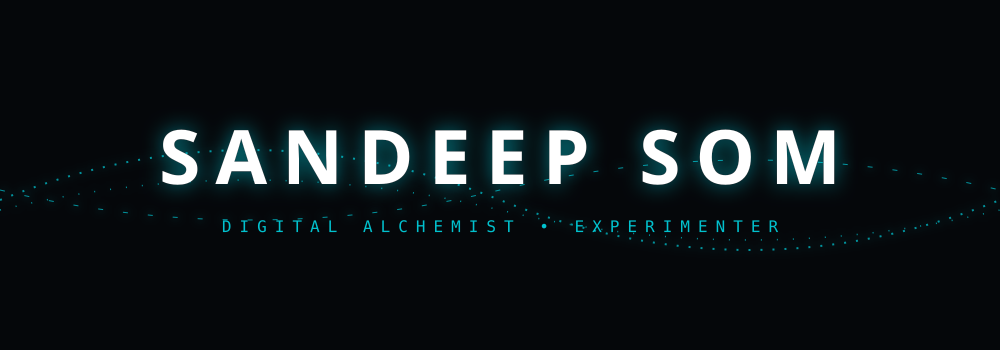
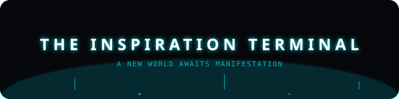

<!-- 01_PINNACLE_ETHEREAL_HEADER -->

 

<!-- 02_IDENTITY_TYPING_ENGINE -->
<h1>
  
</h1>

  <em>"Engineering the impossible. Free for everyone. No profit. No expectations."</em>

 

<!-- 03_SUBMERGED_MISSION_MANIFESTO -->

 

  I am a creative hobbyist and experimenter. To me, code is a medium for art and a tool for impact. I build what the world has yet to see, and I offer it freely—no trackers, no profits, no hidden agendas. Just pure, high-fidelity experiments in <strong>Internal Android Physics</strong> and <strong>Zen Aesthetics</strong>.

 

---

<!-- 04_THE_INSPIRATION_TERMINAL -->

<em>Have an intrusive thought for a new world? Let's manifest it.</em>

 

  

<!-- 05_CONJOINED_FOOTER_BLOCK (No Gap Heartbeat & Zen Footer) -->
<table width="100%" border="0" cellspacing="0" cellpadding="0">
  <tr>
    <td style="line-height: 0;">
      
    </td>
  </tr>
  <tr>
    <td style="line-height: 0;">
      
    </td>
  </tr>
</table>

