<!-- ZEN LIQUID HEADER -->

 

<!-- IDENTITY TYPING -->
<h1>
  
</h1>

  <em>"A creative journey to engineer the impossible. Non-profit. Open-source. Free for humanity."</em>

  

<!-- SUBMERGED MISSION MANIFESTO -->

  I am a creative hobbyist and experimenter. To me, code is not a career—it is a medium for art and a tool for impact. I build what the world has yet to see, and I offer it freely. No trackers, no profits, no expectations. Just pure, high-fidelity experiments in <strong>Internal Android Physics</strong> and <strong>Premium Aesthetics</strong>.

 

<!-- THE BREATHING REPOSITORY BUTTON -->

  

---

## 🛠️ THE EXPERIMENTER'S TOOLKIT

  
  
  

 

---

## 💡 THE INSPIRATION TERMINAL
*Have an idea that doesn't exist in the world yet? Let's architect it together.*

 

  

<!-- FOOTER -->

